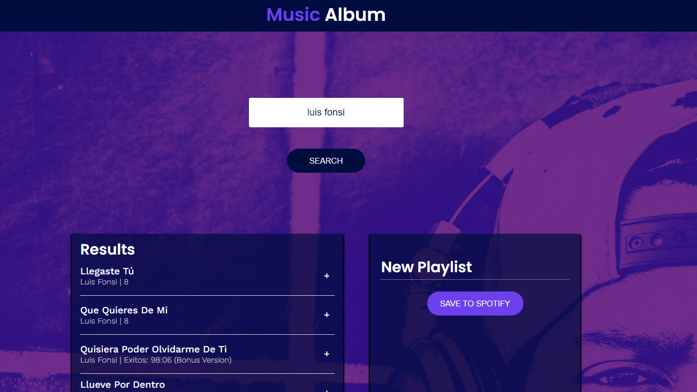

# Album Music

En este proyecto de *CodeCademy* utilizamos `React` y la API de *Spotify* para crear nuestros propios álbumes personalizado de música y artistas favoritos. 

## Objetivo

Mediante [Spotify for Developers](https://developer.spotify.com/) nos conectamos a su API y mediante nuestra propia cuenta de *Spotify* nos brinda la oportunidad buscar esa música o ese artista que nos encanta, creamos el nombre para nuestro nuevo álbum personalizado y comenzamos a agregar nuestras pistas favoritas 🎵🎶. Estás a su vez se guardan automáticamente en nuestra cuenta personal de *Spotify.*

## Scripts Disponibles 

En el directorio de este proyecto, puede ejecutar los siguientes scripts:

### `npm start`

Inicia el proyecto en modo de desarrollo.
Para abrirlo en nuestro explorador de internet: [http://localhost:3000](http://localhost:3000)

### `npm test` 

Inicia el ejecutor de pruebas en el modo de observación interactivo.
Consulte la sección [running tests](https://facebook.github.io/create-react-app/docs/running-tests) para obtener más información.

### `npm build`

Construye la aplicación para producción en la carpeta `build`.
Agrupa correctamente React en modo de producción y optimiza la compilación para obtener el mejor rendimiento.

### `npm run eject`

**Nota: esta es una operación unidireccional. Una vez que `eject`, no puedes volver atrás!**

Si no estás satisfecho con la herramienta de compilación y las opciones de configuración, puedes `eject` en cualquier momento. Este comando eliminará la única dependencia de compilación de tu proyecto.

## Requisitos

Para poder usar las funciones de está aplicación, tendrás que iniciar sección para crear tú integración y administrar tus credenciales en el siguiente enlace: https://developer.spotify.com/dashboard/login.

Luego en el archivo **.env.local** tendrás que poner tu `Client ID` y también tú **Redirect URIs** de configuración. 👌

## Créditos

- [Spotify for Developers](https://developer.spotify.com/)
- [CodeCademy](https://www.codecademy.com/).

👋🏼👋🏼